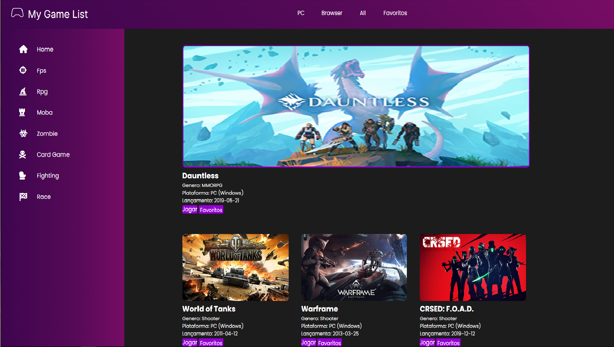
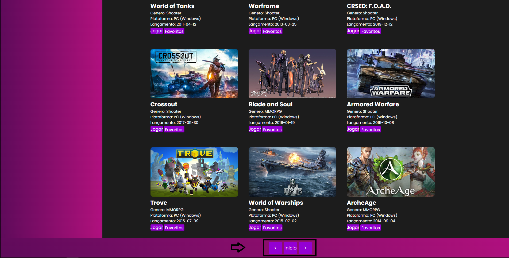
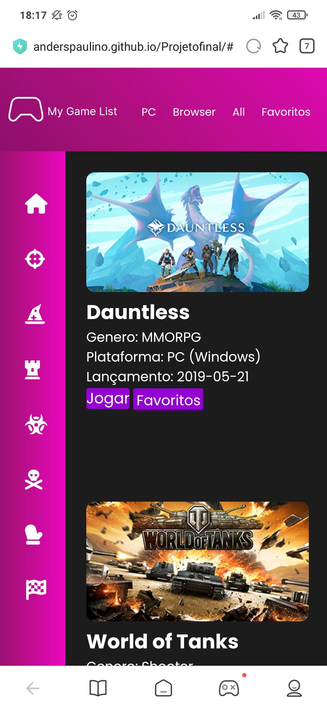

# My Game List

 

## Botões que avançam, e retornam as paginas de jogos da API
 

## Versão mobile do projeto
 

## 🛠 Tecnologias utilizadas na criação do projeto.
- [JavaScript](https://www.javascript.com/)
- [HTML5](https://www.w3schools.com/html/default.asp)
- [CSS3](https://www.w3schools.com/css/default.asp)

## Descrição do Projeto
Catalogo de jogos, que auxlia o usuário a navegar e buscar seus jogos favoritos, e salvar na aba de favoritos, o site captura dados de uma API de jogos e devolve na tela a partir dos filtros selecionados na pagina.

## Próximas melhorias 👨‍🔧
Próxima melhoria na aba favoritos, que será autualizada.

## Criadores-do-Projeto 🚀 
### [Anderson Paulino](https://github.com/AndersPaulino)
### [Enzo Akira](https://github.com/EnzoAkiraInoue)
### [Evelyn Trojack](https://github.com/EvyTR) 

[Inicio](#my-game-list) 